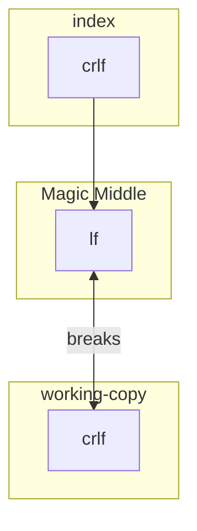

# Reproduction 

1. Checkout on Windows with the following `.gitconfig`:

```gitconfig
# .gitconfig
[core]
	autocrlf = false
```

2. Clone the repository
```bash
git clone https://github.com/DanielHabenicht/bug-reproduction.git-repo.git
```

3. `test.cs` should be shown as `modified`
   
```
git status
On branch main
Your branch is up to date with 'origin/main'.

Changes not staged for commit:
  (use "git add <file>..." to update what will be committed)
  (use "git restore <file>..." to discard changes in working directory)
        modified:   test.cs

no changes added to commit (use "git add" and/or "git commit -a")
```

5. Running any git command like the ones below will not remove the changed file:

```bash
git rm --cached -r .
git reset --hard
git add --renormalize .
```

6. Running `git diff` is even more confusing: 

```diff
warning: CRLF will be replaced by LF in test.cs.
The file will have its original line endings in your working directory
diff --git b/test.cs a/test.cs
index 1e230ed..5464a2d 100644
--- b/test.cs
+++ a/test.cs
@@ -1,11 +1,11 @@
-using System.Diagnostics.CodeAnalysis;
-using System.Linq;
-using Xunit;
-using Moq;
-
-
-
-namespace Tests
-{
-
-}
+using System.Diagnostics.CodeAnalysis;^M
+using System.Linq;^M
+using Xunit;^M
+using Moq;^M
+^M
+^M
+^M
+namespace Tests^M
+{^M
+^M
+}^M
```
> This is showing the exact opposite of what it is doing. Actually it replaces the line encoding of the index (i/crlf) with the right encoding (i/lf)

7. Doing as the warning suggests (`warning: CRLF will be replaced by LF in test.cs. The file will have its original line endings in your working directory`) and replacing `CRLF` by `LF` does silence the warning but does not change the diff itself. 

I get why this is happening, because of this great answer: https://stackoverflow.com/a/71937898/9277073. 
But it is rather unintuitive as there seems to be a hidden middle layer leading to this problem: 



It should be cleared up as: 
- It is confusing to the user
- It breaks changig branches, as nothing can be force reset and git always complains about files being overwritten.
- It breaks squashing as you need to manually intervene if someone forgot to commit all files after a `.gitattributes` change. 
- It does not offer any indications on how to resolve it


## Other testing commands:

```bash
git ls-files --eol
```
