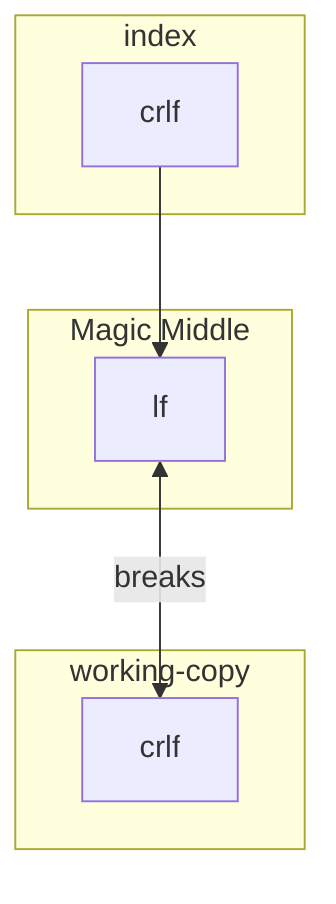

You can view a Markdown rendered version of this reproduction at: https://github.com/DanielHabenicht/bug-reproduction.git-repo

# Description 

When changing the `.gitattributes` file not all changes to the checked in files are apparent.
They only get updated on a new clone or when refreshing the index - that's somehow expected. 
But it creates confusion and unexpected behavior if they are not updated together with the `.gitattributes` changes. 
It can make easy changes between branches impossible, break the flow of squashing commits or lead to confusing state of everlasting uncommited change.

# Reproduction 

1. Checkout with the following `.gitconfig` settings set:

```gitconfig
# .gitconfig
[core]
    autocrlf = false
# Or
    autocrlf = input
```

2. Clone the repository
```bash
git clone https://github.com/DanielHabenicht/bug-reproduction.git-repo.git
```

3. `test.cs` should be shown as `modified`

> This is confusing to the user, he just checked the repo out and did not change a thing. At least there should be a warning?
   
```
git status
On branch main
Your branch is up to date with 'origin/main'.

Changes not staged for commit:
  (use "git add <file>..." to update what will be committed)
  (use "git restore <file>..." to discard changes in working directory)
        modified:   test.cs

no changes added to commit (use "git add" and/or "git commit -a")
```

5. Running any git command like the ones below will not remove the changed file:

```bash
git rm --cached -r .
git reset --hard
git add --renormalize .
```

> This as well is very confusing and there is no indication on why this is happening. 
> Keep in mind that this could happen in error and could be happening to a totally unrelated (to the inital `.gitattributes` change) user. 

6. Running `git diff` is even more confusing, doing as the warning suggests (`warning: CRLF will be replaced by LF in test.cs. The file will have its original line endings in your working directory`) and replacing `CRLF` by `LF` does silence the warning but does not change the diff itself:

```diff
warning: CRLF will be replaced by LF in test.cs.
The file will have its original line endings in your working directory
diff --git b/test.cs a/test.cs
index 1e230ed..5464a2d 100644
--- b/test.cs
+++ a/test.cs
@@ -1,11 +1,11 @@
-using System.Diagnostics.CodeAnalysis;
-using System.Linq;
-using Xunit;
-using Moq;
-
-
-
-namespace Tests
-{
-
-}
+using System.Diagnostics.CodeAnalysis;^M
+using System.Linq;^M
+using Xunit;^M
+using Moq;^M
+^M
+^M
+^M
+namespace Tests^M
+{^M
+^M
+}^M
```

> This is showing the exact opposite of what git is really doing. Actually it replaces the line encoding of the index (i/crlf) with the right encoding (i/lf) (see **[1]**)

8. Try changing the branch to a modified copy with `git checkout some-changes` is not possible (also with recommended command): 

```bash
error: Your local changes to the following files would be overwritten by checkout:
        test.cs
Please commit your changes or stash them before you switch branches.
Aborting
```

The only solution would be to commit - nothing else helps (but thats not really a solution). 

> This makes changing branches harder, as it can't be force reset and git will always complain about files being overwritten.
> It also break the flow for squashing commits as you would need to manually intervene (and add a commit) if someone forgot to commit all files after a .gitattributes change and only recognized it at a later date.

**[1]**: I hope this answer explained it right to me: https://stackoverflow.com/a/71937898/9277073. 
But it is rather unintuitive to me an possible other users as there seems to be a hidden middle layer leading to this problem: 




## Other testing commands:

```bash
git ls-files --eol
```
